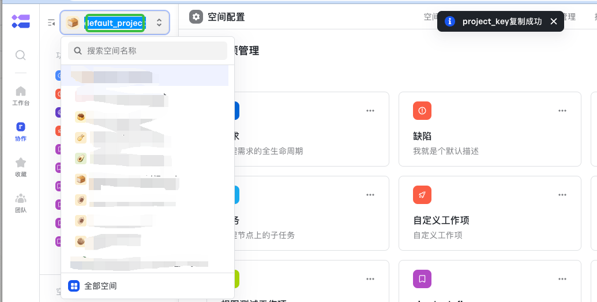
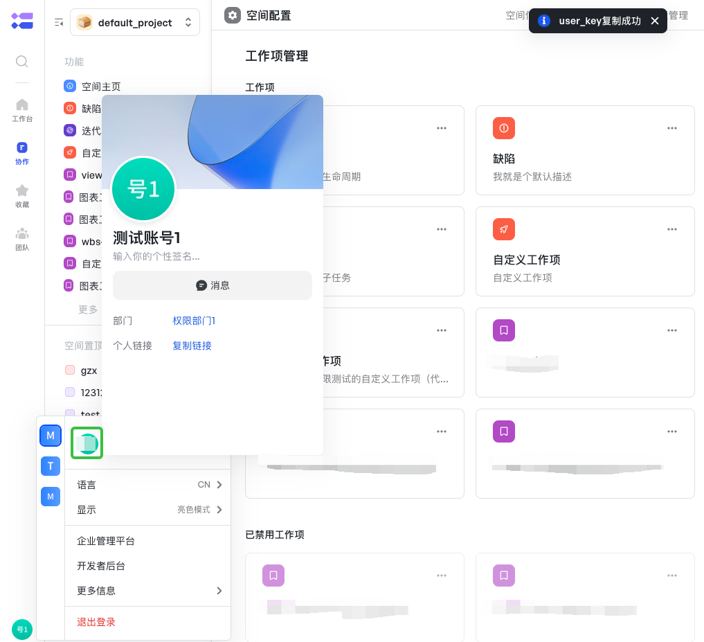

# 飞书项目开放接口SDK

旨在让开发者便捷的调用飞书项目OPEN API

## 目录

<!-- toc -->

- [安装](#安装)
- [API Client](#api-client)
    - [创建API Client](#创建api-client)
    - [配置API Client](#配置api-client)

- [API调用](#api调用)
    - [基本用法](#基本用法)
    - [设置请求选项](#设置请求选项)
- [错误自查](#错误自查)
- [FAQ](#FAQ)

<!-- tocstop -->

## 安装

- 运行环境：JDK 1.8及以上

- 请将以下配置复制并添加 settings.xml文件中：

```shell
<settings>
  <profiles>
    <profile>
        <id>lark-project</id>
        <activation>
            <activeByDefault>true</activeByDefault>
        </activation>
        <repositories>
            <repository>
                <id>lark-project</id>
                <url>https://artifacts-cn-beijing.volces.com/repository/meego/</url>
                <releases>
                    <enabled>true</enabled>
                </releases>
                <snapshots>
                    <enabled>true</enabled>
                </snapshots>
            </repository>
        </repositories>
    </profile>
  </profiles>
</settings>
```

- 请将以下配置复制并添加到 pom.xml文件中：

```shell
<dependency>
  <groupId>com.larksuite.project</groupId>
  <artifactId>oapi-sdk</artifactId>
  <version>1.0.19</version>
</dependency>
```

## API Client

开发者在调用 API 前，需要先创建一个 API Client，然后才可以基于 API Client 发起 API 调用，Client对象线程安全，全局初始化一次即可。

### 创建API Client

```java
import com.lark.project.Client;

public class Sample {

    public static void main(String[] args) throws Exception {
        // 默认插件身份凭证
        Client client = Client.newBuilder("pluginID", "pluginSecret").build();
    }
}
```

### 配置API Client

创建 API Client 时，可对 API Client 进行一定的配置，比如我们可以在创建 API Client 时设置日志级别、设置 http 请求超时时间等等：

```java
import com.lark.project.Client;

public class Sample {

    public static void main(String[] args) throws Exception {
        Client client = Client.newBuilder("pluginID", "pluginSecret")
                .openBaseUrl("https://project.feishu.cn/") // 设置域名
                .requestTimeout(3000) // 设置httpclient 超时时间，默认永不超时
                .disableTokenCache() // 禁用token管理，禁用后需要开发者自己传递token
                .logReqAtDebug(true) // 在 debug 模式下会打印 http 请求和响应的 headers,body 等信息。
                .build();
    }
}
```

每个配置选项的具体含义，如下表格：

<table>
  <thead align=left>
    <tr>
      <th>
        配置选项
      </th>
      <th>
        配置方式
      </th>
       <th>
        描述
      </th>
    </tr>
  </thead>
  <tbody align=left valign=top>
    <tr>
      <th>
        <code>logReqAtDebug</code>
      </th>
      <td>
        <code>client.logReqAtDebug(boolean logReqAtDebug)</code>
      </td>
      <td>
设置是否开启 Http 请求参数和响应参数的日志打印开关； 开启后，在 debug 模式下会打印 http 请求和响应的 headers,body 等信息。
在排查问题时，开启该选项，有利于问题的排查。

</td>
</tr>

<tr>
      <th>
        <code>BaseUrl</code>
      </th>
      <td>
        <code>client.openBaseUrl(String baseUrl)</code>
      </td>
      <td>
设置飞书项目域名，默认为https://project.feishu.cn

</td>
</tr>

<tr>
      <th>
        <code>AccessTokenType</code>
      </th>
      <td>
        <code>client.accessTokenType(AccessTokenType accessTokenType)</code>
      </td>
      <td>
设置 plugin_token 类型，枚举值如下：

- AccessTokenTypePlugin（插件身份凭证）
- AccessTokenTypeVirtualPlugin（虚拟plugin_token）

</td>
</tr>

<tr>
      <th>
        <code>TokenCache</code>
      </th>
      <td>
        <code>client.tokenCache(ICache cache)</code>
      </td>
      <td>
设置 token 缓存器，用来缓存 token, 默认实现为内存。

如开发者想要定制 token 缓存器，需实现下面 Cache 接口:

```java
public interface ICache {

    // 获取缓存值
    String get(String key);

    // 设置缓存值
    void set(String key, String value, int expire, TimeUnit timeUnit);
}
```

</td>
</tr>


<tr>
      <th>
        <code>disableTokenCache</code>
      </th>
      <td>
        <code>client.disableTokenCache()</code>
      </td>
      <td>
设置是否开启 Token 的自动获取与缓存。

默认开启，如需要关闭可传递 false。
</td>
</tr>

<tr>
      <th>
        <code>requestTimeout</code>
      </th>
      <td>
        <code>client.requestTimeout(long timeout)</code>
      </td>
      <td>
设置 SDK 内置的 Http Client 的请求超时时间单位为毫秒，默认为0代表永不超时。
</td>
</tr>

<tr>
      <th>
        <code>httpTransport</code>
      </th>
      <td>
        <code>client.httpTransport(IHttpTransport httpTransport)</code>
      </td>
      <td>
设置传输层实现，用于替换 SDK 提供的默认实现。
开发者可通过实现下面的 IHttpTransport 接口来设置自定义的 传输实现:

```java
public interface IHttpTransport {

    RawResponse execute(RawRequest request) throws Exception;
}

```

</td>
</tr>

  </tbody>
</table>

## API调用

创建完毕 API Client，我们可以使用 ``Client.业务域.方法名称`` 来定位具体的 API 方法，然后对具体的 API 发起调用。

飞书项目开放平台开放的所有 API 列表，可点击[这里查看](https://bytedance.feishu.cn/docs/doccntEfMPoh8Qv3hDCshfRLEuY#9kPTAz)

### 基本用法

如下示例我们通过 client 调用空间业务的 ListProjectWorkItemType
方法，获取空间下的工作项类型列表：

``` java
import com.lark.project.Client;
import com.lark.project.core.request.RequestOptions;
import com.lark.project.core.utils.Jsons;
import com.lark.project.service.project.builder.ListProjectWorkItemTypeReq;
import com.lark.project.service.project.builder.ListProjectWorkItemTypeResp;

public class Sample {

    public static void main(String[] args) throws Exception {
        // 构建client
        Client client = Client.newBuilder("pluginID", "pluginSecret")
                .openBaseUrl("https://project.feishu.cn/").build();
        // 创建请求对象
        ListProjectWorkItemTypeReq req = ListProjectWorkItemTypeReq.newBuilder()
                .projectKey("project_key")
                .build();
        // 发起请求
        ListProjectWorkItemTypeResp resp = client.getProjectService().listProjectWorkItemType(req, RequestOptions.newBuilder()
                .userKey("user_key")
                .build());

        // 处理服务端错误
        if (!resp.success()) {
            System.out.println(String.format("code:%s,msg:%s,reqId:%s"
                    , resp.getErrCode(), resp.getErrMsg(), resp.getRequestId()));
            return;
        }

        // 业务数据处理
        System.out.println(Jsons.DEFAULT.toJson(resp.getData()));
    }
}

```

### 设置请求选项

开发者在每次发起 API 调用时，可以设置请求级别的一些参数，比如传递 UserPluginAccessToken ,自定义 Headers 等：

```java
import com.lark.project.Client;
import com.lark.project.core.request.RequestOptions;
import com.lark.project.core.utils.Jsons;
import com.lark.project.core.utils.Lists;
import com.lark.project.service.project.builder.ListProjectWorkItemTypeReq;
import com.lark.project.service.project.builder.ListProjectWorkItemTypeResp;

import java.util.HashMap;
import java.util.List;
import java.util.Map;

public class Sample {

    public static void main(String[] args) throws Exception {
        // 构建client
        Client client = Client.newBuilder("pluginID", "pluginSecret")
                .openBaseUrl("https://project.feishu.cn/").build();
        // 创建请求对象
        ListProjectWorkItemTypeReq req = ListProjectWorkItemTypeReq.newBuilder()
                .projectKey("project_key")
                .build();

        // 创建自定义 Headers
        Map<String, List<String>> headers = new HashMap<>();
        headers.put("key1", Lists.newArrayList("value1"));
        headers.put("key2", Lists.newArrayList("value2"));

        // 发起请求
        ListProjectWorkItemTypeResp resp = client.getProjectService().listProjectWorkItemType(req, RequestOptions.newBuilder()
                .accessToken("user_token") // 传递用户token
                .headers(headers) // 传递自定义 Headers
                .build());

        // 处理服务端错误
        if (!resp.success()) {
            System.out.println(String.format("code:%s,msg:%s,reqId:%s"
                    , resp.getErrCode(), resp.getErrMsg(), resp.getRequestId()));
            return;
        }

        // 业务数据处理
        System.out.println(Jsons.DEFAULT.toJson(resp.getData()));
    }
}

```

如下表格，展示了所有请求级别可设置的选项：

<table>
  <thead align=left>
    <tr>
      <th>
        配置选项
      </th>
      <th>
        配置方式
      </th>
       <th>
        描述
      </th>
    </tr>
  </thead>
  <tbody align=left valign=top>
    <tr>
      <th>
        <code>headers</code>
      </th>
      <td>
       <code> requestOptions.headers(Map&lt;String, List&lt;String>> headers)</code>
      </td>
      <td>
设置自定义请求头，开发者可在发起请求时，这些请求头会被透传到飞书项目开放平台服务端。

</td>
</tr>

<tr>
      <th>
        <code>accessToken</code>
      </th>
      <td>
        <code>requestOptions.accessToken(String accessToken)</code>
      </td>
      <td>
设置token。

</td>
</tr>

<tr>
      <th>
        <code>userKey</code>
      </th>
      <td>
        <code>requestOptions.userKey(String userKey)</code>
      </td>
      <td>
设置X-USER-KEY。

</td>
</tr>

<tr>
      <th>
        <code>idemUUID</code>
      </th>
      <td>
        <code>requestOptions.idemUUID(String idemUUID)</code>
      </td>
      <td>
设置X-IDEM-UUID。
</td>
</tr>


  </tbody>
</table>

## 错误自查

[查看错误码](https://bytedance.feishu.cn/docs/doccn3CyRRA52nL9HiYR2v9XC8K)

## FAQ

### project_key如何获取

飞书项目中双击空间名称，如下图所示



### user_key如何获取

飞书项目左下角双击个人头像，如下图所示




